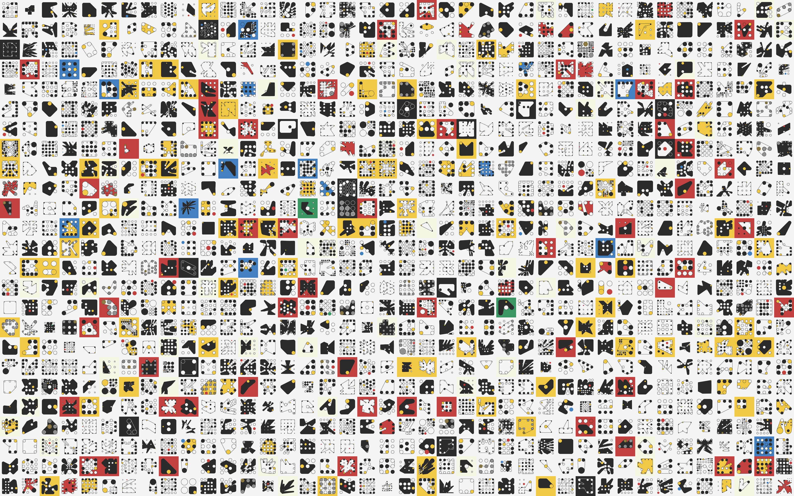
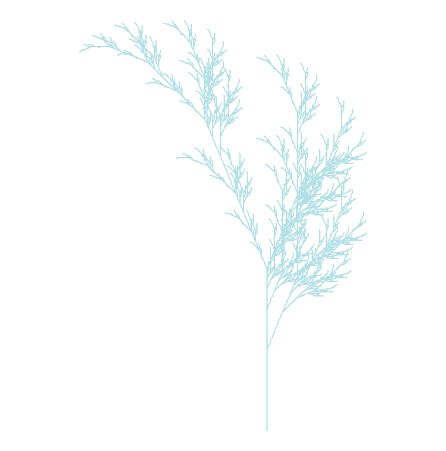
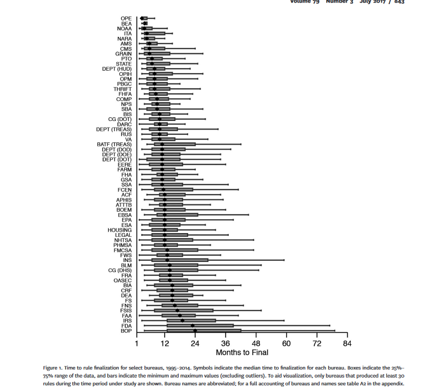

# Assignment One

1.  According to [Avant Arte](https://avantarte.com/insights/guides/what-is-generative-art), generative art is "art created with the use of an autonomous system".

    Here is an example displayed in the above article of Dmitri Cherniak's generative artworks from 2023.



2.  This is my generated image. The winter color I chose was powder blue.



3.  This is an example of a chart from an article that I will critique. This is Figure 1 from "Slow-Rolling, Fast-Tracking, and the Pace of Bureaucratic Decisions in Rulemaking". This figure is overwhelming and includes too many bureaus. It's hard to immediately associate the ends of the lines with what bureau they correspond to. While the caption does specify that the appendix clears up the abbreviations used for the bureaus, the use of abbreviations makes it difficult to tell what is being demonstrated. The use of abbreviations makes this chart much harder to understand if you aren't familiar with abbreviations used by American government bureaus which could disproportionately impact the ability of non-Americans to understand the chart. Additionally, without making clear what these bureaus are patterns and groupings across types of bureaus cannot be intermediately ascertained.



References:

<https://avantarte.com/insights/guides/what-is-generative-art>

Potter, Rachel Augustine. “Slow-Rolling, Fast-Tracking, and the Pace of Bureaucratic Decisions in Rulemaking.” *The Journal of Politics*, vol. 79, no. 3, July 2017, pp. 841–55. *DOI.org (Crossref)*, <https://doi.org/10.1086/690614>.

# Assignment Two

Here is Murrell's examples with the questions answered.

```{r}
### Paul Murrell's R examples (selected)

## Start plotting from basics 
# Note the order
plot(pressure, pch=20)  # Can you change pch? Yes, pch can be changed and it changes the shape of the points.
text(150, 600, 
     "Pressure (mm Hg)\nversus\nTemperature (Celsius)")

#  Examples of standard high-level plots 
#  In each case, extra output is also added using low-level 
#  plotting functions.
# 

# Setting the parameter (3 rows by 2 cols)
par(mfrow=c(3, 2))

# Scatterplot
# Note the incremental additions

x <- c(0.5, 2, 4, 8, 12, 16)
y1 <- c(1, 1.3, 1.9, 3.4, 3.9, 4.8)
y2 <- c(4, .8, .5, .45, .4, .3)

# Setting label orientation, margins c(bottom, left, top, right) & text size
par(las=1, mar=c(4, 4, 2, 4), cex=.7) 
plot.new()
plot.window(range(x), c(0, 6))
lines(x, y1)
lines(x, y2)
points(x, y1, pch=16, cex=3) # Try different cex value?  If you change the cex value it changes the size of the points.
points(x, y2, pch=21, bg="white", cex=2)  # Different background color
par(col="gray50", fg="gray50", col.axis="gray50")
axis(1, at=seq(0, 16, 4)) # What is the first number standing for? # The first number is which side of the graph the axis is on. 1 is the bottom, 3 is the top, 2 is the left, and 4 is the right.
axis(2, at=seq(0, 6, 2))
axis(4, at=seq(0, 6, 2))
box(bty="u")
mtext("Travel Time (s)", side=1, line=2, cex=0.8)
mtext("Responses per Travel", side=2, line=2, las=0, cex=0.8)
mtext("Responses per Second", side=4, line=2, las=0, cex=0.8)
text(4, 5, "Bird 131")
par(mar=c(5.1, 4.1, 4.1, 2.1), col="black", fg="black", col.axis="black")

# Histogram
# Random data
Y <- rnorm(50)
# Make sure no Y exceed [-3.5, 3.5]
Y[Y < -3.5 | Y > 3.5] <- NA # Selection/set range
x <- seq(-3.5, 3.5, .1)
dn <- dnorm(x)
par(mar=c(4.5, 4.1, 3.1, 0))
hist(Y, breaks=seq(-3.5, 3.5), ylim=c(0, 0.5), 
     col="gray80", freq=FALSE)
lines(x, dnorm(x), lwd=2)
par(mar=c(5.1, 4.1, 4.1, 2.1))

# Barplot
par(mar=c(2, 3.1, 2, 2.1)) 
midpts <- barplot(VADeaths, 
                  col=gray(0.1 + seq(1, 9, 2)/11), 
                  names=rep("", 4))
mtext(sub(" ", "\n", colnames(VADeaths)),
      at=midpts, side=1, line=0.5, cex=0.5)
text(rep(midpts, each=5), apply(VADeaths, 2, cumsum) - VADeaths/2,
     VADeaths, 
     col=rep(c("white", "black"), times=3:2), 
     cex=0.8)
par(mar=c(5.1, 4.1, 4.1, 2.1))  

# Boxplot
par(mar=c(3, 4.1, 2, 0))
boxplot(len ~ dose, data = ToothGrowth,
        boxwex = 0.25, at = 1:3 - 0.2,
        subset= supp == "VC", col="white",
        xlab="",
        ylab="tooth length", ylim=c(0,35))
mtext("Vitamin C dose (mg)", side=1, line=2.5, cex=0.8)
boxplot(len ~ dose, data = ToothGrowth, add = TRUE,
        boxwex = 0.25, at = 1:3 + 0.2,
        
        subset= supp == "OJ")
legend(1.5, 9, c("Ascorbic acid", "Orange juice"), 
       fill = c("white", "gray"), 
       bty="n")
par(mar=c(5.1, 4.1, 4.1, 2.1))

# Persp
x <- seq(-10, 10, length= 30)
y <- x
f <- function(x,y) { r <- sqrt(x^2+y^2); 10 * sin(r)/r }
z <- outer(x, y, f)
z[is.na(z)] <- 1
# 0.5 to include z axis label
par(mar=c(0, 0.5, 0, 0), lwd=0.5)
persp(x, y, z, theta = 30, phi = 30, 
      expand = 0.5)
par(mar=c(5.1, 4.1, 4.1, 2.1), lwd=1)

# Piechart
par(mar=c(0, 2, 1, 2), xpd=FALSE, cex=0.5)
pie.sales <- c(0.12, 0.3, 0.26, 0.16, 0.04, 0.12)
names(pie.sales) <- c("Blueberry", "Cherry",
                      "Apple", "Boston Cream", "Other", "Vanilla")
pie(pie.sales, col = gray(seq(0.3,1.0,length=6))) 

# Exercise: Can you generate these charts individually?  
# Yes I can generate them inidivually all you need 
#to do is not set the parameters so there is an array 
#of plots and then plot out a single graph.

# Try these functions using another dataset. Be sure to work on the layout and margins.


```

```{r}


# Setting the parameter (3 rows by 2 cols)
par(mfrow=c(3, 2))

# Scatterplot
# Note the incremental additions

x <- c(1.5, 3, 6, 7.5, 11, 12, 16, 24, 20, 18)
y1 <- c(1.5, 3, 4, 8, 9.75, 11, 13, 15, 28, 24)
y2 <- c(10, 8, 7, 6, 6.13, 5, 4.5, 1, .3, .25)

# Setting label orientation, margins c(bottom, left, top, right) & text size
par(las=1, mar=c(4, 4, 2, 4), cex=.7) 
plot.new()
plot.window(range(x), c(0, 30))
lines(x, y1)
lines(x, y2)
points(x, y1, pch=16, cex=3) # Try different cex value?  If you change the cex value it changes the size of the points.
points(x, y2, pch=21, bg="white", cex=2)  # Different background color
par(col="gray50", fg="gray50", col.axis="gray50")
axis(1, at=seq(0, 16, 4)) # What is the first number standing for? # The first number is which side of the graph the axis is on. 1 is the bottom, 3 is the top, 2 is the left, and 4 is the right.
axis(2, at=seq(0, 6, 2))
axis(4, at=seq(0, 6, 2))
box(bty="u")
mtext("Travel Time (s)", side=1, line=2, cex=0.8)
mtext("Responses per Travel", side=2, line=2, las=0, cex=0.8)
mtext("Responses per Second", side=4, line=2, las=0, cex=0.8)
text(4, 5, "Bird 131")
par(mar=c(5.1, 4.1, 4.1, 2.1), col="black", fg="black", col.axis="black")

# Histogram
# Random data
Y <- rnorm(100)
# Make sure no Y exceed [-3.5, 3.5]
Y[Y < -5.5 | Y > 5.5] <- NA # Selection/set range
x <- seq(-5.5, 5.5, .1)
dn <- dnorm(x)
par(mar=c(4.5, 4.1, 3.1, 0))
hist(Y, breaks=seq(-3.5, 3.5), ylim=c(0, 0.5), 
     col="gray80", freq=FALSE)
lines(x, dnorm(x), lwd=2)
par(mar=c(5.1, 4.1, 4.1, 2.1))

# Barplot
par(mar=c(2, 3.1, 2, 2.1)) 
midpts <- barplot(VADeaths, 
                  col=gray(0.1 + seq(1, 9, 2)/11), 
                  names=rep("", 4))
mtext(sub(" ", "\n", colnames(VADeaths)),
      at=midpts, side=1, line=0.5, cex=0.5)
text(rep(midpts, each=5), apply(VADeaths, 2, cumsum) - VADeaths/2,
     VADeaths, 
     col=rep(c("white", "black"), times=3:2), 
     cex=0.8)
par(mar=c(5.1, 4.1, 4.1, 2.1))  

# Boxplot
par(mar=c(3, 4.1, 2, 0))
boxplot(len ~ dose, data = ToothGrowth,
        boxwex = 0.25, at = 1:3 - 0.2,
        subset= supp == "VC", col="white",
        xlab="",
        ylab="tooth length", ylim=c(0,35))
mtext("Vitamin C dose (mg)", side=1, line=2.5, cex=0.8)
boxplot(len ~ dose, data = ToothGrowth, add = TRUE,
        boxwex = 0.25, at = 1:3 + 0.2,
        
        subset= supp == "OJ")
legend(1.5, 9, c("Ascorbic acid", "Orange juice"), 
       fill = c("white", "gray"), 
       bty="n")
par(mar=c(5.1, 4.1, 4.1, 2.1))

# Persp
x <- seq(-10, 10, length= 30)
y <- x
f <- function(x,y) { r <- sqrt(x^2+y^2); 10 * sin(r)/r }
z <- outer(x, y, f)
z[is.na(z)] <- 1
# 0.5 to include z axis label
par(mar=c(0, 0.5, 0, 0), lwd=0.5)
persp(x, y, z, theta = 30, phi = 30, 
      expand = 0.5)
par(mar=c(5.1, 4.1, 4.1, 2.1), lwd=1)

# Piechart
par(mar=c(0, 2, 1, 2), xpd=FALSE, cex=0.5)
pie.sales <- c(0.12, 0.3, 0.26, 0.16, 0.04, 0.12)
names(pie.sales) <- c("Blueberry", "Cherry",
                      "Apple", "Boston Cream", "Other", "Vanilla")
pie(pie.sales, col = gray(seq(0.3,1.0,length=6))) 

```

# Assignment Three

1.  

```{r}
# Histogram
# Random data
Y <- rnorm(50) #This randomly generates data.
# Make sure no Y exceed [-3.5, 3.5]
Y[Y < -3.5 | Y > 3.5] <- NA # Selection/set range
x <- seq(-3.5, 3.5, .1)
dn <- dnorm(x)
par(mar=c(4.5, 4.1, 3.1, 0))
hist(Y, breaks=seq(-3.5, 3.5), ylim=c(0, 0.5), 
     col="gray80", freq=FALSE) #This makes the histogram.
lines(x, dnorm(x), lwd=2) # This draws the line of normal distribution.
par(mar=c(5.1, 4.1, 4.1, 2.1))
```

2a. The four regression models all have different datasets with different shapes, yet they all produce the same line of best fit.

2b. When the colors of the plot are changed it is much easier to distinguish the points of the graph from the line.

```{r}
## Data Visualization
## Objective: Identify data or model problems using visualization
## Anscombe (1973) Quartlet

data(anscombe)  # Load Anscombe's data
View(anscombe) # View the data
summary(anscombe)

## Simple version
plot(anscombe$x1,anscombe$y1)
summary(anscombe)

# Create four model objects
lm1 <- lm(y1 ~ x1, data=anscombe)
summary(lm1)
lm2 <- lm(y2 ~ x2, data=anscombe)
summary(lm2)
lm3 <- lm(y3 ~ x3, data=anscombe)
summary(lm3)
lm4 <- lm(y4 ~ x4, data=anscombe)
summary(lm4)
plot(anscombe$x1,anscombe$y1)
abline(coefficients(lm1))
plot(anscombe$x2,anscombe$y2)
abline(coefficients(lm2))
plot(anscombe$x3,anscombe$y3)
abline(coefficients(lm3))
plot(anscombe$x4,anscombe$y4)
abline(coefficients(lm4))


## Fancy version (per help file)

ff <- y ~ x
mods <- setNames(as.list(1:4), paste0("lm", 1:4))

# Plot using for loop
for(i in 1:4) {
  ff[2:3] <- lapply(paste0(c("y","x"), i), as.name)
  ## or   ff[[2]] <- as.name(paste0("y", i))
  ##      ff[[3]] <- as.name(paste0("x", i))
  mods[[i]] <- lmi <- lm(ff, data = anscombe)
  print(anova(lmi))
}

sapply(mods, coef)  # Note the use of this function
lapply(mods, function(fm) coef(summary(fm)))

# Preparing for the plots
op <- par(mfrow = c(2, 2), mar = 0.1+c(4,4,1,1), oma =  c(0, 0, 2, 0))

# Plot charts using for loop
for(i in 1:4) {
  ff[2:3] <- lapply(paste0(c("y","x"), i), as.name)
  plot(ff, data = anscombe, col = "red", pch = 21, bg = "orange", cex = 1.2,
       xlim = c(3, 19), ylim = c(3, 13))
  abline(mods[[i]], col = "blue")
}
mtext("Anscombe's 4 Regression data sets", outer = TRUE, cex = 1.5)
par(op)
```
